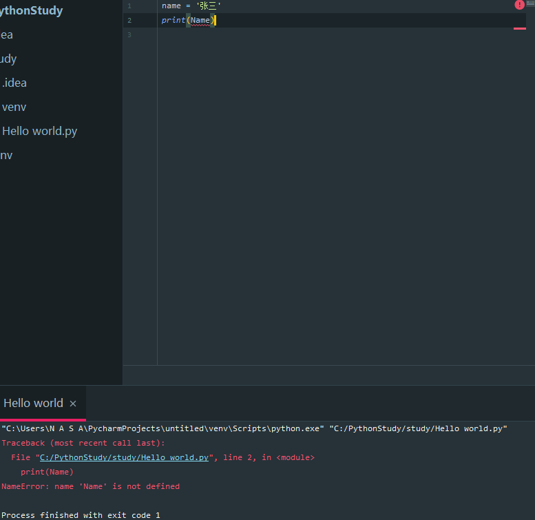
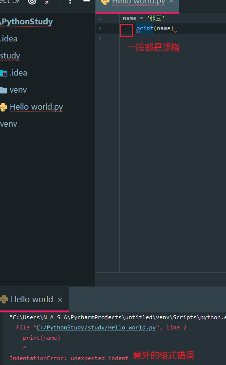
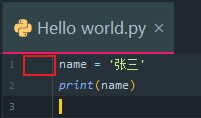
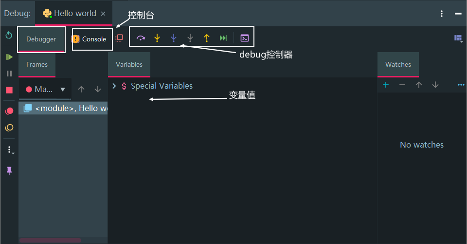
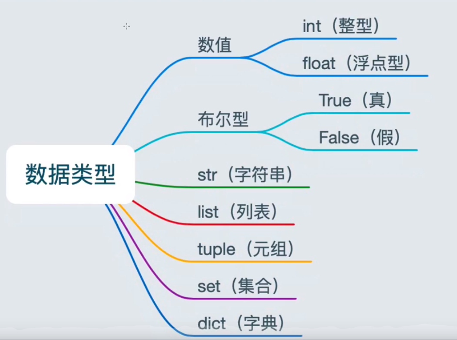
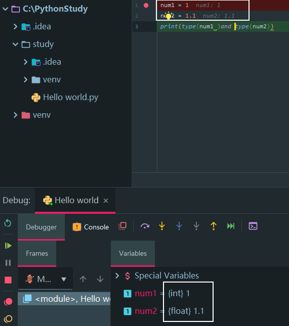
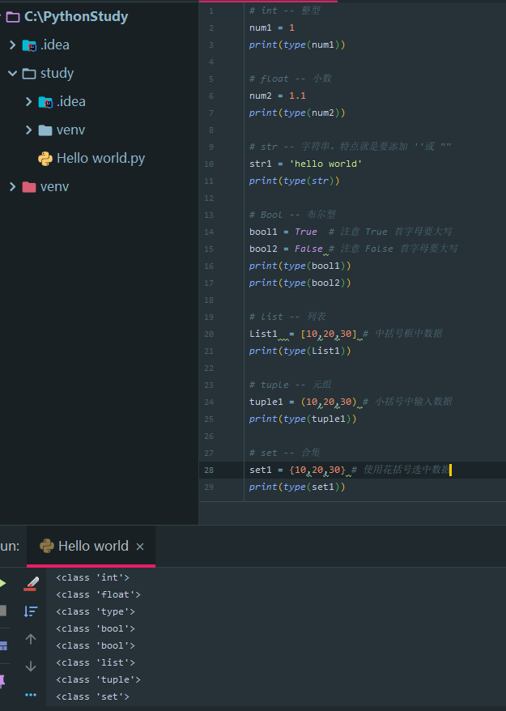

# Python - 基础

- [学习来源](https://www.bilibili.com/video/BV1o4411M71o?p=1)

- 
- 👴 I hear her voice in the morning hours,She calls me
<<[Take Me Home Country Roads](http://music.163.com/song?id=1313205002&userid=262256866)>> 
专辑：Take Me Home: The John Denver Story
歌手：David Meol

> 我比较喜欢的翻唱版本，墨水乐队翻唱，喜欢可以去苹果买正版！

### 安装Python

- [Python下载](https://www.python.org/downloads/windows/)

### Python是啥

- 编程语言 脚本语言 也可以理解为胶水语言。

- 需要过解析器，所以只需要有对应语言的解析器即可跨平台。
如C平台的解析器，和Java平台的解析器。

- [Pycharm](https://www.jetbrains.com/pycharm/download/) IDE工具

推荐插件：
- Material Theme UI 我最爱的UI，谁用谁知道！

- Rainbow Brackets 彩虹括号，真心好用。

- Markdown Image Support MD解析器。


自选 😂懒得一个一个写了


### 注释的分类和语法

注释的作用：用人类读得懂的语言对代码进行解释说明，方便日后维护。

给大家举个生动形象的栗子：


如果是个初学者，或者没什么代码基础的看到上面这段代码，第一反应是啥？
色彩丰富？这堆代码就这么堆叠在一起，既不美观也影响阅读。甚至阅读你个代码还要看个说明书。

我们再看下面这端代码：


代码整洁，十分潇洒。中间穿插注释，即使是初学者也能大体理解代码的功能。


单行注释：
```py
# 注释内容 
```
> 在注释符号和注释内容中要加空格。行业标准 在Pycharm中可以使用快捷键 `Ctrl+/` 

多行注释：
```py
'''
    多行注释
    多行注释
    多行注释
    多行注释
'''

"""
    多行注释
    多行注释
    多行注释
    多行注释
"""
```
---

### 变量

#### 命名规范

**变量命名**
标识符命名规则的Python中定义各种名字的时候的统一规范，具体如下：
  - 由数字、字母、下划线组成
  - 不能使用数字开头
  - 不能使用内置关键字
  - 严格区分大小写
  
**命名习惯**

  - 见名知义 如:`year = 2077`
  - 大驼峰：每个字母首字母大写，如：`MyName`
  - 小驼峰：第二个以后的单词首字母大写，如：`myName`
  - 下划线：如：`my_name`


#### 变量赋值

将值赋给变量：

`变量名 = 值`


```py
name = '张三'
print(name)
```

#### 调试BUG

写一个最简单的小BUG:
```py
name = '张三'
print(Name)
```



错误信息显示为到变量名 `Name`,尝试阅读错误信息。修复bug。建议整理一个报错集锦方便排错和修复。



意外的缩进。

在编写的时候，解析器会按照从上到下解析。所以编写时一定要先定义，后调用。


#### Debug工具 调试代码

Debug工具是Pycharm 中的集成工具，在这里程序员可以查看程序的执行细节和流程或者调试BUG。

Debug工具使用步骤：
  1. 打断点

  2. Debug调试

- **打断点**

**添加断点位置**
在需要调试的代码块的第一行，定义一个断点即可.



点击红框区域即可添加断点


单击目标代码的行号右侧空白位置。


点击这个按钮开始Debug，调试代码。



[教学连接](https://blog.csdn.net/u011331731/article/details/72801449/)


### 数据类型

Python中为了应对不同的业务需求，把数据类型分为不同的类型。




- 数据类型
    - 整型：int
    - 浮点型：float
    - 字符串：str
    - 布尔型：bool
    - 元组：tuple
    - 集合：set
    - 字典：dict


对于定量的类型，Py会定义不同的数据类型。举例：
```py
num1 = 1
num2 = 1.1
print(type(num1))

```


和C++，Java不同，不需要自定义数据类型。简单的数据类型将会被 Py 自动分配。这也是弱类型语言的一种特点。





从头认识数据类型，先学前几个，只至于后面的四个 `数据序列` ，再说吧!🐦🐦🐦
先认识认识就行了


```py
# int -- 整型
num1 = 1
print(type(num1))

# float -- 小数
num2 = 1.1
print(type(num2))

# str -- 字符串，特点就是要添加 ''或 ""
str1 = 'hello world'
print(type(str))

# Bool -- 布尔型
bool1 = True  # 注意 True 首字母要大写
bool2 = False # 注意 False 首字母要大写
print(type(bool1))
print(type(bool2))

# list -- 列表
List1  = [10,20,30] # 中括号框中数据
print(type(List1))

# tuple -- 元组
tuple1 = (10,20,30)
print(type(tuple1))

# set -- 合集
set1 = {10,20,30}
print(type(set1))

# dict -- 字典
dict1 = {'name':'TOM','age':18}
print(type(dict1))
```
---

## 输出

将程序输出内容给用户看

```py
print('hellow world')

age = 20
print(age)
```

#### 格式化输出

- **1. 整数的输出**

    |格式化符号|进制|举例|结果|
    |---|---|---|---|
    |%o|八进制|`print('%o' % 20)`|24|
    |%d|十进制|`print('%d' % 20)`|20|
    |%x|十六进制|`print('%d' % 20)`|14|

- **2. 浮点数输出**

    |格式化符号|含义|应用|举例|结果|
    |---|---|-|---|---|
    |%f|保留小数点后面六位有效数字|`%.3f` 保留3位小数位|`print('%f' % 1.11)`|1.110000|
    |%e|保留小数点后面六位有效数字，指数形式输出|`%.3e` 保留3位小数位，使用科学计数法 `1.110e+00`|`print('%e' % 1.11)`|1.110000e+00
    |%g|在保证六位有效数字的前提下，使用小数方式，否则使用科学计数法|`%.3g` 保留3位有效数字，使用小数或科学计数法 1.1e+03|`print('%g' % 1111.1111)`|1111.11


- **3.内置round()**

        round(number[, ndigits])
    > 参数：
    number - 这是一个数字表达式。
    ndigits - 表示从小数点到最后四舍五入的位数。默认值为0。
    返回值
    该方法返回x的小数点舍入为n位数后的值。

```py
round(1.1125)  # 四舍五入，不指定位数，取整
1

round(1.1135,3)  # 取3位小数，由于3为奇数，则向下“舍”
1.113

round(2.675,2)  # 无法理解
2.67
```


- **4.字符串输出**

`%s`

        %10s——右对齐，占位符10位
        %-10s——左对齐，占位符10位
        %.2s——截取2位字符串
        %10.2s——10位占位符，截取两位字符串
    ```py
    1 >>> print('%s' % 'hello world')  # 字符串输出
    2 hello world
    3 >>> print('%20s' % 'hello world')  # 右对齐，取20位，不够则补位
    4          hello world
    5 >>> print('%-20s' % 'hello world')  # 左对齐，取20位，不够则补位
    6 hello world         
    7 >>> print('%.2s' % 'hello world')  # 取2位
    8 he
    9 >>> print('%10.2s' % 'hello world')  # 右对齐，取2位
    10         he
    11 >>> print('%-10.2s' % 'hello world')  # 左对齐，取2位
    12 he
    ```


- **5.字符串格式代码如下**

    


- **6.常用转义字符如下**

    


### 转义字符

  - `\n`: 换行。
     ```py
     print("hello\nworld")


    hello
    world
     ```


  - `\t`: 制表符，一个Tab键(4个空格)的距离。
    ```py
    print("hello\tworld")

    hello	world # 四个空格
    ```

### 结束字符

```py
print('hello',end="\n" )
```
在Python 中 ，`print` 自带结束 `end="\n" ` 符号，导致两个 `print` 之间会直接换行展示 ，也可以使用 `end` 自定义更改结束符。

`end` 可以使用转义符做结束符号，也可以用任意字符串做结束符号。


### 总结

  - 输出。
  - 格式化输出。
  - 转义和结束字符。


---


## 输入

在 Python 中，遇到需要接收用户输入的数据的功能。即是获取输入的数值。


**语法**

    input("提示信息")


**特点**

  - 当程序执行到 `input` 后，等待用户输入，输入`完成之后`才继续向下执行。
  - 在 Python 中， `input` 接受用户输入后，一般会存储到变量，方便用户使用。
  - 在 Python 中， `input` 会把接受到的任意用户输入的数据都当作`字符串(str)`处理

> 也就是说 ，当接受到的用户信息要当场int型要强制转换。

**演示**

```py
in1=input("输入信息")
print(in1)
```


**转换数据类型**

转换数据类型的函数
|函数|说明|
|-|-|
|常见函数||
|int(x[base])|将X转换成一个整数|
|float(X)|将X转换成一个浮点数|
|str(x)|将对象X转换为字符串|
|eval(str)|用于计算在字符串中的有效python表达式，并返回一个对象|
|tuple(s)|将序列s转换为一个元组(雪月饼😂)|
|list(s)|将序列s转换为一个列表|
|不常见函数||
|repr(x)||
|chr(x)|将一个整数转换为一个unicode字符|
|ord(x)|将一个字符转换为它的 ASCll 整数值|
|complex(real[,imag])|创建一个复数，real为实部，imag为虚部|
|hex(x)|将一个整数转换为一个十六进制字符串|

写法基本一致：
```py
int(numb1)
```

以一个数字字典生成器为例：

```py

start = int(input("请输入开始的数值："))
end = int(input("请输入结束的数值："))
num = int(input("请输入生成的位数："))
path = str(start)+"到"+str(end)+"的"+str(num)+"位数字典.txt"#输出的字典名

for i in range(start,end+1):   # 生成从start到end的字典
    s = str(i).zfill(num)         #生成六位数的字典
    with open(path,"a") as f:  #打开文件
        f.write(str(s) + "\n")    #写入文件
        f.close()
```

示例：
  1. int() -- 将数据转换成` int `型
  ```py
  int(nmb)
  ```
  2. str() -- 将数据转换成字符串型
  ```py
  print(type(str(numb1)))
  ```
  3. tuple() -- 将一个序列转换成元组
  ```py
  list1=[10,20,30]
  print(tuple(list1))
  ```
  4. list() -- 将一个序列转换成列表
  ```py
  t1=(100，200，300)
  print(list(t1))
  ```
  5. eval() -- 自动发现数据中的有效` python `表达式，并返回一个对象。
  ```py
  num=1
  eval(num)

  # 自动转换为int
  ```
---

## 运算符的分类

  - 算数运算符
  - 赋值运算符
  - 复合赋值运算符
  - 比较运算符
  - 逻辑运算符


**算数运算符**
|运算符|描述|实例|
|-|-|-|
|+|加|1+1=2|
|-|减|1-1=0|
|* |乘| 2*2=4|
|/|除|10/2=5|
|//|整除|9//2=4|
|%|取余|9%4=1|
|** |指数| 2**4=16，即 `2*2*2*2`|
|()|小括号|小括号由于提高运算优先级。`(1+2)*3=9`|


